# Python-challenge 
### Python - "The one common language loved across all programmers !"

## Background
This repository brings a python solution for real-life situations. The situations encompass financial, election, human resources, and linguistic research data. The financial data sourced under [PyBank/Resources](PyBank/Resources/budget_data.csv) folder, the election data sourced under [PyPoll/Resources](PyPoll/Resources/) folder, the human resource data sourced under [ PyBoss/Resources](PyBoss/Resources/employee_data.csv) folder, and the research data sourced under [PyParagraph/Resources](PyParagraph/Resources) folder.

The code's organized to analyze the data, and create an output file in the Analysis subfolder in each project.

Note : All the main codes are set up to the relative path to be auto-adjusted in your working directory, however, the path in the video below is just my directory for demonstration.

For example the relative directories looks as follows:

 For import `data_path=os.path.join('Resources', 'budget_data.csv')`
 
 For Export Output `output_file = os.path.join('Analysis', 'pyBank_output.txt')`

<!-- TABLE OF CONTENTS -->
## Table of Contents

* [PyBank](PyBank/)
  * [Resources](PyBank/Resources/budget_data.csv)
  * [Main Code](PyBank/main.py)
  * [Analysis output](PyBank/Analysis/pyBank_output.txt)
* [PyPoll](PyPoll/)
  * [Resources](PyPoll/Resources/)
  * [Main Code](PyPoll/main.py)
  * [Analysis output](PyPoll/Analysis/pyPoll_output.txt)
* [PyBoss](PyBoss/)
  * [Resources](PyBoss/Resources/employee_data.csv)
  * [Main Code](PyBoss/main.py)
  * [Analysis output](PyBoss/Analysis/pyBoss_output.txt)
* [PyParagraph](PyParagraph/)
  * [Resources](PyParagraph/Resources/)
  * [Main Code](PyParagraph/main.py)
  * [Analysis output](PyParagraph/Analysis/pyParagraph_output.txt)
  
## PyBank
In this challenge, a python script created to analyze the financial data of a company and give an output. The dataset [budget data](PyBank/Resources/budget_data.csv) is composed of two columns: `Date` and `Profit/Losses`.

 
 Image Source: https://globalcompliancepaneltraining.wordpress.com/
 
The [main script](PyBank/main.py) analyzes, and create an output in PyBank [Analysis](PyBank/Analysis/pyBank_output.txt) sub-folder. 
 
  The code looks as follows:
 
 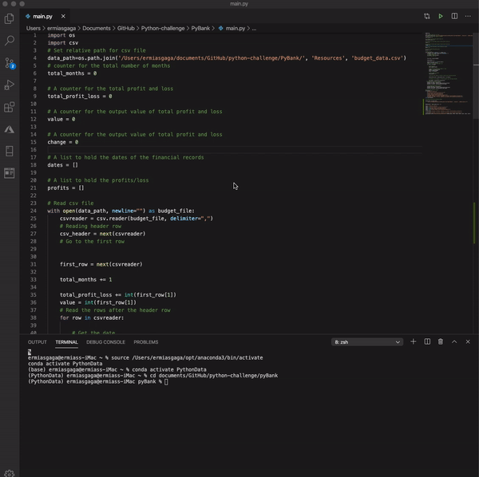
 
 The code compute the following tasks:
 
  * The total number of months included in the dataset

  * The net total amount of "Profit/Losses" over the entire period

  * The average of the changes in "Profit/Losses" over the entire period

  * The greatest increase in profits (date and amount) over the entire period

  * The greatest decrease in losses (date and amount) over the entire period

The output looks as follows:

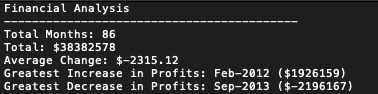

 ## PyPoll
 
 In this challenge, a python script created to modernize a vote-counting process of a small rural town. This script used [election dataset](PyPoll/Resources/), and it is composed of three columns: `Voter ID`, `County`, and `Candidate`.
 
 
 
 Image Source https://www.thedp.com/staff/camille-rapay
 
The [main script](PyPoll/main.py) analyzes, and create an output in PyPoll [Analysis](PyPoll/Analysis/pyPoll_output.txt) sub-folder. 
 
  The code looks as follows:
  
  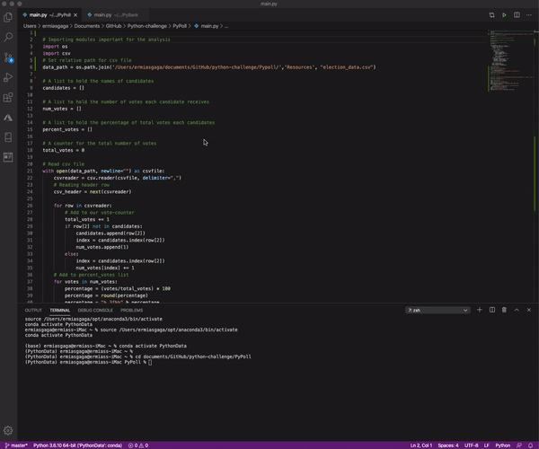
 
 The code compute the following tasks:
 
  * The total number of votes cast

  * A complete list of candidates who received votes

  * The percentage of votes each candidate won

  * The total number of votes each candidate won

  * The winner of the election based on popular vote.
  
  The output looks as follows:

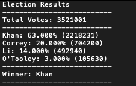
  
## PyBoss 
 
In this challenge, a python script created to convert older employee's data into the new format. The [dataset](PyBoss/Resources/employee_data.csv) generated from a Tuna 2.0 company, a world-changing snack food based on canned tuna fish. A new format is needed because the company recently decided to purchase a new HR system, and this new system requires employee records to be stored completely differently.
 
 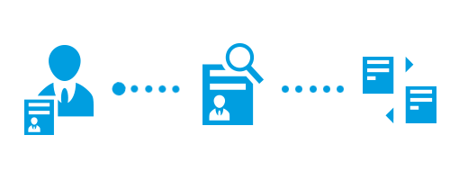

The [main script](PyBoss/main.py) analyzes, and create the new format as an output in PyBoss [Analysis](PyPoll/Analysis/pyPoll_output.txt) sub-folder.

The code looks as follows:

 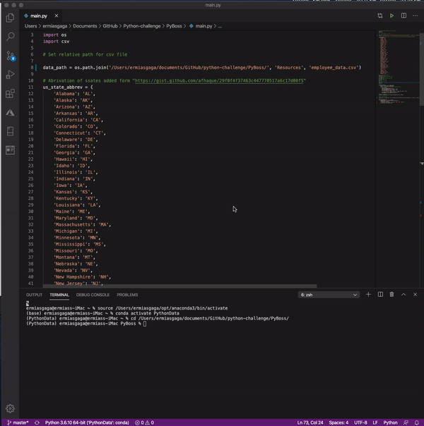
 
 The code compute the following tasks:
 
  * The `Name` column should be split into separate `First Name` and `Last Name` columns.

  * The `DOB` data should be re-written into `MM/DD/YYYY` format.

  * The `SSN` data should be re-written such that the first five numbers are hidden from view.

  * The `State` data should be re-written as simple two-letter abbreviations.
  
  Before it looks as follows:
  
 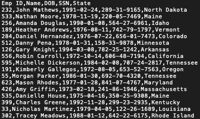
  
 After the output looks as follows:
  
 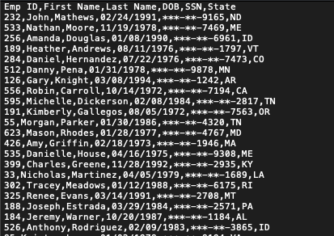
 
## PyParagraph
  
In this challenge, a python script created to automate and assess the complexity of the passage used for a linguistic research program. The passage is originated from the sophomoric Twilight novel to the nauseatingly high-minded article. You can find the passages [passages](PyParagraph/Resources/) in the resources folder. 
  
  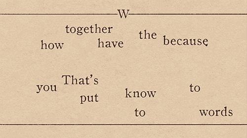
 
The [main script](PyParagraph/main.py) analyzes, and create a text output in pyParagraph [Analysis](PyParagraph/Analysis/pyParagraph_output.txtt) sub-folder.  
 
 The code looks as follows:
 
 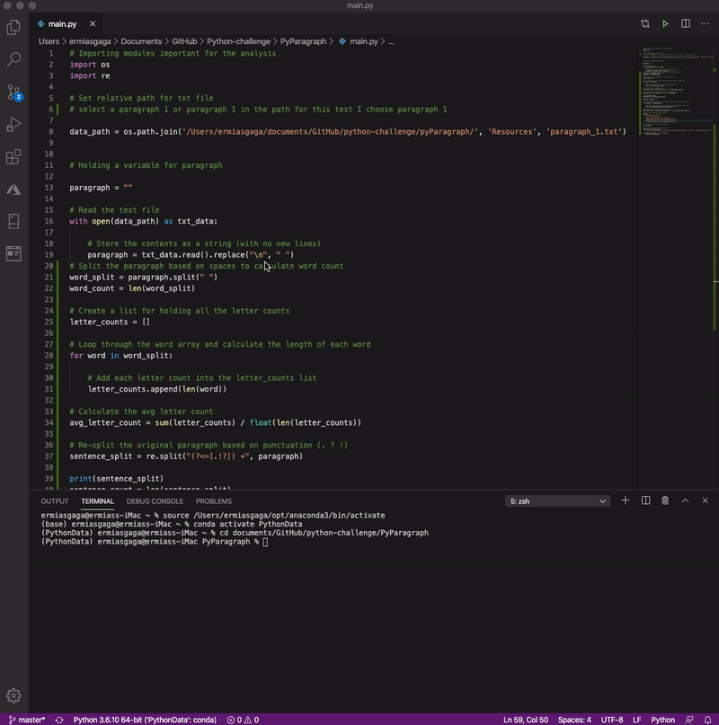
 
 The code compute the following tasks:
 
  * Import a text file filled with a paragraph of your choosing.
  
  * Count approximate word

  * Count approximate sentence 

  * Count approximate letter (per word)

  * Average sentence length (in words)
  
  The output looks as follows:
  
  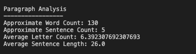
  

  The passage output looks as follows:
  
  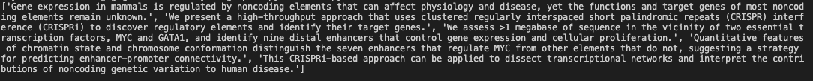
 
  
  

This Code is compiled and written for the Python class Homework in the Data Analytics Bootcamp class given by-Trilogy Education Services at the University of Toronto, continuing studies. The code used learning resources from the class.

 © 2020 Trilogy Education Services

  
 
 
 
