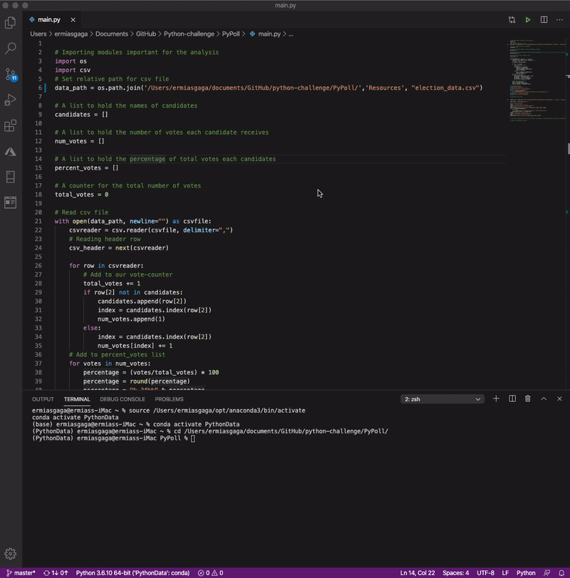

# Python-challenge 
### Python - "The one common language loved across all programmers !"

## Background
This repository brings a python solution for real-life situations. The situations encompass financial, election, human resources, and lingustic research data. The financial data sourced under [PyBank/Resources](PyBank/Resources/budget_data.csv) folder, the election data sourced under [PyPoll/Resources](PyPoll/Resources/) folder, the human resource data sourced under [ PyBoss/Resources](PyBoss/Resources/employee_data.csv) folder, and the research data sourced under [PyParagraph/Resources](PyParagraph/Resources) folder. 

The code's organized to analyze the data, and create an output file in the Analysis subfolder in each projects. 

<!-- TABLE OF CONTENTS -->
## Table of Contents

* [PyBank](PyBank/)
  * [Resources](PyBank/Resources/budget_data.csv)
  * [Main Code](PyBank/main.py)
  * [Analysis output](PyBank/Analysis/pyBank_output.txt)
* [PyPoll](PyPoll/)
  * [Resources](PyPoll/Resources/)
  * [Main Code](PyPoll/main.py)
  * [Analysis output](PyPoll/Analysis/pyPoll_output.txt)
* [PyBoss](PyBoss/)
  * [Resources](PyBoss/Resources/employee_data.csv)
  * [Main Code](PyBoss/main.py)
  * [Analysis output](PyBoss/Analysis/pyBoss_output.txt)
* [PyParagraph](PyParagraph/)
  * [Resources](PyParagraph/Resources/)
  * [Main Code](PyParagraph/main.py)
  * [Analysis output](PyParagraph/Analysis/pyParagraph_output.txt)
  
  ## PyBank
  
  In this challenge a python script created to analyze financial data of a company and give an output. The dataset [budget
  data](PyBank/Resources/budget_data.csv) is composed of two columns: `Date` and `Profit/Losses`.

 
 
 The [main script](PyBank/main.py) analyzes, and create an out put in PyBank [Analysis](PyBank/Analysis/pyBank_output.txt) sub-folder. 
 
  The code looks as follows:
 
 
 
 The code compute the following tasks:
 
  * The total number of months included in the dataset

  * The net total amount of "Profit/Losses" over the entire period

  * The average of the changes in "Profit/Losses" over the entire period

  * The greatest increase in profits (date and amount) over the entire period

  * The greatest decrease in losses (date and amount) over the entire period

The output looks as follows:

 ## PyPoll
 
 In this challenge, a python script created to modernize a vote counting proces of a small rural town. These script used [election data](PyPoll/Resources/). The dataset is composed of three columns: `Voter ID`, `County`, and `Candidate`.
 
  
 
 The [main script](PyPoll/main.py) analyzes, and create an out put in PyPoll [Analysis](PyPoll/Analysis/pyPoll_output.txt) sub-folder. 
 
  The code looks as follows:
  
 
 The code compute the following tasks:
 
  * The total number of votes cast

  * A complete list of candidates who received votes

  * The percentage of votes each candidate won

  * The total number of votes each candidate won

  * The winner of the election based on popular vote.
  
  The output looks as follows:

  
 ## PyBoss 
 
 In this challenge a python script created to convert older employees data in to the new format.The [dataset](PyBoss/Resources/employee_data.csv)generated from a Tuna 2.0 company, a world-changing snack food based on canned tuna fish. A new format is needed because the company recently decided to purchase a new HR system, and this new system requires employee records be stored completely differently.
 
 

The [main script](PyBoss/main.py) analyzes, and create the new format as an out put in PyBoss [Analysis](PyPoll/Analysis/pyPoll_output.txt)sub-folder. 

The code looks as follows:
 
 
 The code compute the following tasks:
 
  * The `Name` column should be split into separate `First Name` and `Last Name` columns.

  * The `DOB` data should be re-written into `MM/DD/YYYY` format.

  * The `SSN` data should be re-written such that the first five numbers are hidden from view.

  * The `State` data should be re-written as simple two-letter abbreviations.
  
  Before it looks as follows:
  
 
  
 After the output looks as follows:
  
 
 
 

  
 
 
 
